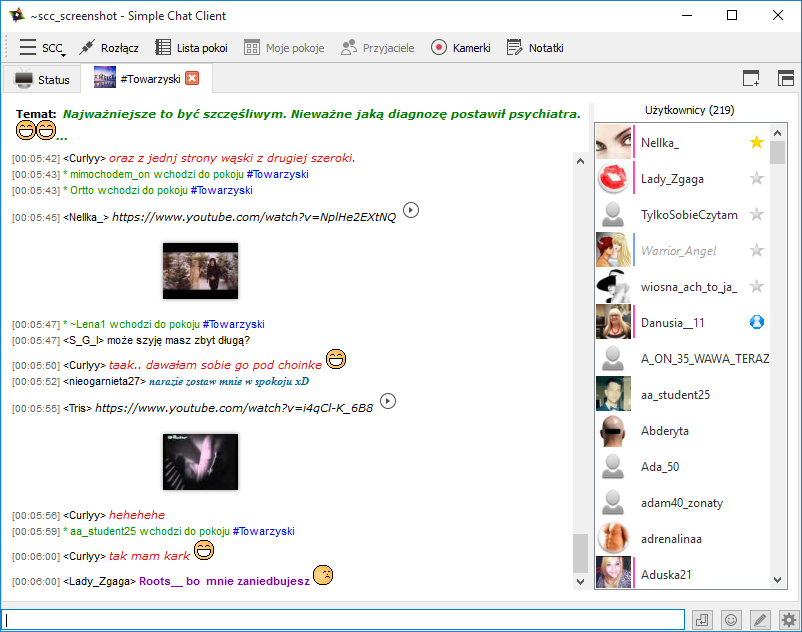

## [Simple Chat Client](https://simplechatclient.github.io "Simple Chat Client Offical Site") 
 
 

Simple Chat Client is a lightweight and simple program which allows talking in the czat.onet.pl
without using a browser or java.

The program of the assumptions is small, lightweight and stable client.

## Install & Run ##

### Windows ###

1. Download Windows Installer from [https://simplechatclient.github.io/download](https://simplechatclient.github.io/download)
2. Run downloaded installer

### Linux ###

1. Download Debian Installer from [https://simplechatclient.github.io/download](https://simplechatclient.github.io/download)
2. Run downloaded installer

## Compiling

### Windows Requirements

[Microsoft Visual C++ 2013 Redistributable Package (x86)](http://www.microsoft.com/en-us/download/details.aspx?id=40784)

Example Environment variables for development:

PATH

	c:\Qt\5.5\mingw492_32\bin;c:\Qt\Tools\mingw492_32\bin;C:\Program Files (x86)\CMake\bin;

QT_DIR

	c:\Qt\5.5\mingw492_32\bin\

### Linux Debian/Ubuntu packages

	cmake make pkg-config g++ qtbase5-dev libqt5webkit5-dev libqca-qt5-2-dev qtmultimedia5-dev libssl-dev
	

Install qca plugin from https://projects.kde.org/projects/kdesupport/qca/repository

We need qca build with Qt5 support. Current version from packages is with Qt4 support.

	$ git clone git://anongit.kde.org/qca
	$ cd qca
	$ cmake .
	$ make
	$ sudo make install

### Custom build

If you want to use "cmake" with custom options, type::

	cmake . [options]
	make
	make install

On Windows "make install" does not fully work. Edit cmake options in compile.bat instead.

### Available options

	-DWIN32_QCA2_DIR=DIR

compile with custom libQCA path i.e.: -DWIN32_QCA2_DIR=C:\QCA2

	-DCMAKE_BUILD_TYPE=Debug

compile with full debug
